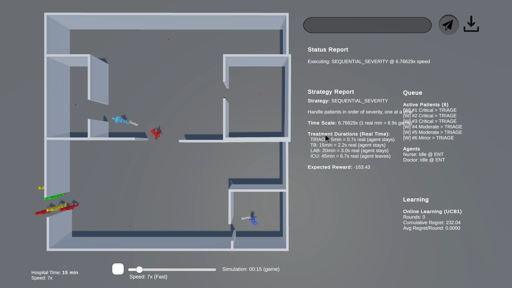

# ORIENT-H

**Online Regret learning for Intelligent Emergency Navigation & Task assignment in Healthcare**

A multi-agent reinforcement learning system that optimizes emergency healthcare task assignment using Counterfactual Regret Minimization (CFR) to learn optimal coordination strategies between doctors and nurses in emergency unit scenarios.

---

## Overview

ORIENT-H implements a regret minimization framework for dynamic multi-agent task assignment in emergency healthcare settings. The system uses CFR to evaluate and learn optimal strategies for coordinating doctor-nurse teams when handling multiple patients with varying severity levels.



---

## Scientific Background

### Core Algorithm: Counterfactual Regret Minimization (CFR)

The system models doctor-nurse coordination as a multi-agent game where:
- **Game State**: Patients with health values (0-100), room constraints, waiting penalties
- **Actions**: Treatment assignments, patient routing through pathways
- **Reward**: Patient health improvement, completion bonuses, penalty avoidance
- **Regret**: Difference between optimal strategy value and actual strategy value

### Key Concepts

- **Regret Matching**: Strategy probabilities updated based on accumulated counterfactual regrets
- **Nash Equilibrium**: Converges to optimal mixed strategy over multiple iterations
- **Strategy Evaluation**: All possible coordination strategies evaluated via simulation rollouts
- **Convergence Analysis**: Tracks cumulative regret growth, Nash distance, and probability evolution

---

## Architecture

```
┌─────────────────┐
│   Unity Client  │ ← Visual Simulation & Interaction
└────────┬────────┘
         │ HTTP/REST
┌────────▼────────┐
│  Flask Server   │ ← Natural Language Processing & API
│   (app.py)      │
└────────┬────────┘
         │
┌────────▼────────┐
│  Regret Engine  │ ← CFR Algorithm & Strategy Evaluation
│(regret_engine.py)│
└─────────────────┘
```

### Components

**1. Regret Engine Core** (`server/regret_engine.py`)
   - Patient and GameState data structures
   - Game simulator with health mechanics
   - CFR regret minimizer implementation
   - Strategy generator and evaluator

**2. Unity Visualization** (`Unity_Assets/`)
   - 3D hospital environment
   - Agent controllers (Nurse, Doctor)
   - Patient management system
   - Real-time visualization of treatment execution

**3. Flask API Server** (`server/app.py`)
   - Natural language patient description parsing
   - RESTful endpoints for Unity communication
   - Analysis result export

---

## Implementation Details

### Game Mechanics

**Agents:**
- **Doctor**: Healing power 60, handles critical care (TB, ICU)
- **Nurse**: Healing power 40, handles TRIAGE, assists doctor
- **Cooperative Bonus**: +20% effectiveness when working together

**Patients:**
- **Critical**: Initial health 30, deadline 25min, pathway: TRIAGE → TB → ICU
- **Moderate**: Initial health 50, deadline 45min, pathway: TRIAGE → TB → LAB → TB
- **Minor**: Initial health 70, deadline 30min, pathway: TRIAGE → TB

**Health System:**
- Health range: 0-100 (0 = death)
- Waiting penalties: Critical -3/min, Moderate -2/min, Minor -1/min
- Room effectiveness multipliers: TRIAGE (10%), TB (30%), LAB (15%), ICU (50%)

### Strategy Types

1. **PARALLEL_CRITICAL**: Both agents work on critical patients first, then split
2. **SEQUENTIAL_SEVERITY**: Handle patients in order of severity, one at a time
3. **DOCTOR_CRITICAL_NURSE_OTHERS**: Doctor handles critical, nurse handles others
4. **COOPERATIVE_ALL**: Both agents work together on each patient
5. **NEAREST_FIRST**: Each agent takes nearest patient
6. **NURSE_TRIAGE_DOCTOR_TREAT**: Role-based assignment

### CFR Process

1. **Initialize**: Set up regret accumulators and strategy probabilities
2. **Evaluate Strategies**: Simulate each strategy multiple times to compute expected values
3. **Compute Regrets**: Calculate counterfactual regrets for each strategy
4. **Update Probabilities**: Apply regret matching to update selection probabilities
5. **Converge**: Repeat until Nash equilibrium approximation is reached
6. **Visualize**: Generate comprehensive analysis charts and data exports

---

## Quick Start

### Prerequisites

- Python 3.8+
- Unity 2021.3+ (for visualization)
- Required Python packages (see `requirements.txt`)

### Server Setup

```bash
cd server
pip install -r ../requirements.txt
python app.py
```

Server runs on `http://localhost:5000`

### Unity Setup

See [UNITY_RUN_GUIDE.txt](UNITY_RUN_GUIDE.txt) for detailed Unity integration instructions.

**Quick Steps:**
1. Import Unity assets into Unity project
2. Set up NavMesh for agent navigation
3. Configure GameManager with agent and UI references
4. Start server, then run Unity scene
5. Enter patient descriptions and observe agent coordination

---

## Output & Analysis

The system generates comprehensive CFR analysis reports:

**Generated Files:**
- `cfr_analysis_TIMESTAMP.png` - 9-panel visualization dashboard
- `cfr_data_TIMESTAMP.json` - Raw regret data and convergence metrics
- Individual plot images for each analysis component

**Analysis Metrics:**
- Cumulative regret convergence
- Strategy probability evolution
- Nash equilibrium distance
- Per-strategy regret comparison
- Expected value trajectories

---

## API Endpoints

| Endpoint | Method | Description |
|----------|--------|-------------|
| `/process_scenario` | POST | Parse text, spawn patients, get plan |
| `/get_plan` | POST | Get optimal action plan for current queue |
| `/complete_step` | POST | Mark patient step complete |
| `/patient_exit` | POST | Remove patient who exited scene |
| `/queue_status` | GET | Current queue and learning stats |
| `/reset` | POST | Reset analyzer state |
| `/save_analysis` | POST | Generate regret analysis charts |

---

## Project Structure

```
ORIENT-H/
├── server/
│   ├── app.py                 # Flask API server
│   ├── regret_engine.py       # CFR algorithm implementation
│   └── output/                # Analysis results
├── Unity_Assets/
│   ├── Scripts/               # Unity C# scripts
│   └── Scenes/                # Unity scene files
├── requirements.txt           # Python dependencies
├── UNITY_RUN_GUIDE.txt        # Unity setup instructions
└── README.md                  # This file
```

---

## Key Features

- **Multi-Agent Coordination**: Optimizes doctor-nurse task assignment
- **Regret Minimization**: Uses CFR for strategy learning
- **Real-Time Visualization**: Unity-based 3D simulation
- **Natural Language Input**: LLM-powered patient description parsing
- **Comprehensive Analysis**: Detailed regret convergence visualization
- **Extensible Architecture**: Modular design for strategy and algorithm customization

---

## Research Applications

- Multi-agent reinforcement learning in healthcare
- Emergency department resource optimization
- Regret minimization algorithms
- Nash equilibrium computation in stochastic games
- Healthcare task scheduling and coordination

---

## Contact

**Farshad Askari**  
Email: farshadaskari94@tamu.edu

For questions, collaborations, or more information about the project, please contact the author.

---

## License

This project is developed for academic research purposes.

---

## Acknowledgments

Developed as part of research in multi-agent reinforcement learning and healthcare optimization at Texas A&M University.

